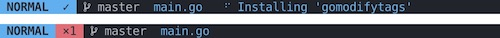

# lightline-coc

This plugin provides [coc](https://github.com/neoclide/coc.nvim) diagnostics indicator for the [lightline](https://github.com/itchyny/lightline.vim) vim plugin.



## Installation

Install using a plugin manager of your choice, for example [`vim-plug`](https://github.com/junegunn/vim-plug):

```viml
Plug 'josa42/vim-lightline-coc'
```

## Components

- `coc_errors` Number of diagnosics errors
- `coc_warnings` Number of diagnosics warnings
- `coc_info` Number of diagnosics information messages
- `coc_hints` Number of diagnosics hints
- `coc_ok` Checkmark if there are no errors or warnings
- `coc_status` Show status messeges if there are any.

## Integration

```viml
let g:lightline = {
  \   'active': {
  \     left': [[  'coc_info', 'coc_hints', 'coc_errors', 'coc_warnings', 'coc_ok' ], [ 'coc_status'  ]]
  \   }
  \ }

" register compoments:
call lightline#coc#register()
```

**Or register manually**

```viml
" Register the components:
let g:lightline = {}
let g:lightline.component_expand = {
  \   'linter_warnings': 'lightline#coc#warnings',
  \   'linter_errors': 'lightline#coc#errors',
  \   'linter_info': 'lightline#coc#info',
  \   'linter_hints': 'lightline#coc#hints',
  \   'linter_ok': 'lightline#coc#ok',
  \   'status': 'lightline#coc#status',
  \ }

" Set color to the components:
let g:lightline.component_type = {
  \   'linter_warnings': 'warning',
  \   'linter_errors': 'error',
  \   'linter_info': 'info',
  \   'linter_hints': 'hints',
  \   'linter_ok': 'left',
  \ }

" Add the components to the lightline:
let g:lightline.active = {
  \   left': [[ 'coc_info', 'coc_hints', 'coc_errors', 'coc_warnings', 'coc_ok' ], [ 'coc_status'  ]]
  \ }
```

## Configuration

- `g:lightline#coc#indicator_warnings`
  The indicator to use when there are warnings. Default is `•`.

- `g:lightline#coc#indicator_errors`
  The indicator to use when there are errors. Default is `×`.

- `g:lightline#coc#indicator_info`
  The indicator to use when there are information messages. Default is `~`.

- `g:lightline#coc#indicator_hints`
  The indicator to use when there are hints. Default is `>`.

- `g:lightline#coc#indicator_ok`
  The indicator to use when there are no warnings or errors. Default is `✓`.

## Credit

- The plugin is based on [`maximbaz/lightline-ale`](https://github.com/maximbaz/lightline-ale)

## License

[MIT © Josa Gesell](LICENSE)
